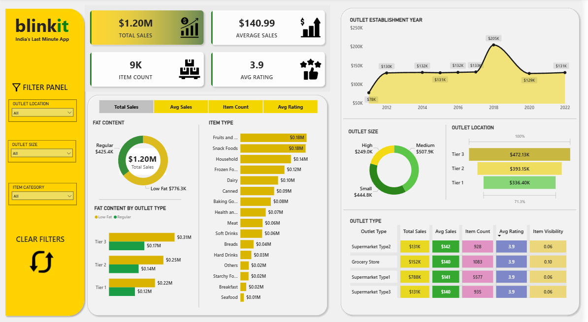

# Blinkit-Sales-Dashboard
Blinkit Sales Dashboard in Power BI using Power query, DAX measures and visualizations based on different KPIs (sales, Avg. rating etc.) generating valuable insights about the sales with respect to different outlet types, sizes, locations, product category, Year of establishment etc.

